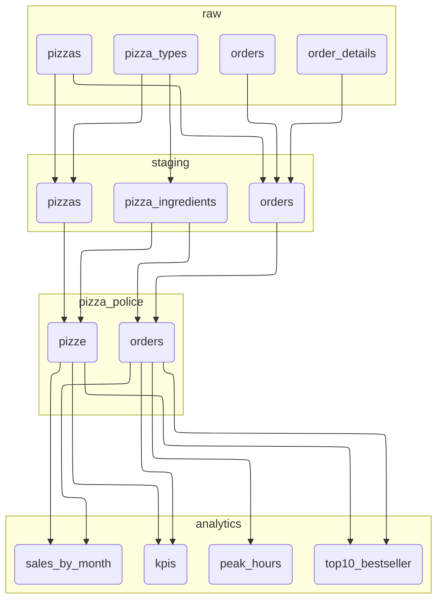

# The Great Pizza Cleanup

Showcasing Lea: our secret weapon in the battle against pizza pretenders. Lea helps us slice through the clutter, identifying and tossing out the most outrageous pizza claims.

[Read more](https://leonardonatale.github.io/blog/the-great-pizza-cleanup/)!

## Installation

This project it built on top of [DuckDB](https://duckdb.org/) and [MotherDuck](https://motherduck.com/). You can find more info on how to get your motherduck token [here](https://motherduck.com/docs/getting-started/connect-query-from-python/installation-authentication/#authenticating-to-motherduck).

- `poetry install`
- `cp .env.example .env` and fill the username variable
- `poetry shell`

## Usage

- `lea prepare`
- `lea run`
- `lea docs` (optional)

## Final Flowchart

