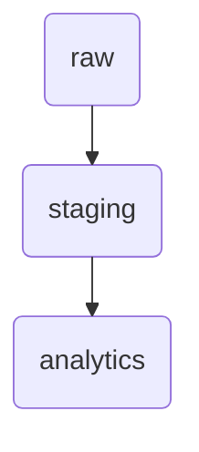
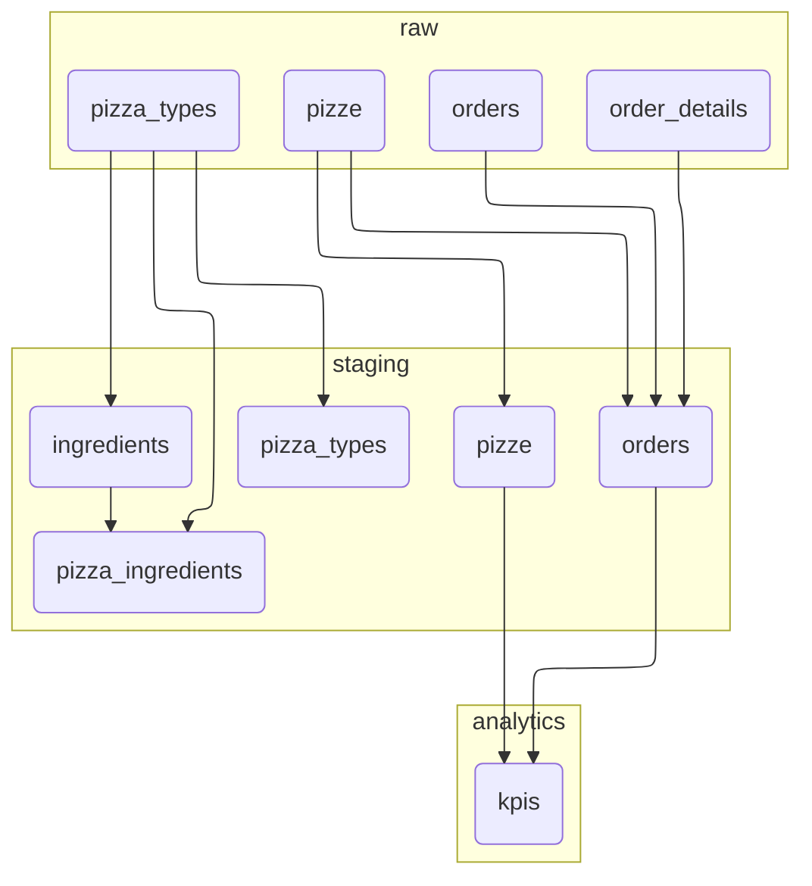

# Views

## Schemas

- [`analytics`](./analytics)
- [`raw`](./raw)
- [`staging`](./staging)

## Schema flowchart

```mermaid
%%{init: {"flowchart": {"defaultRenderer": "elk"}} }%%
flowchart TB
    analytics(analytics)
    raw(raw)
    staging(staging)
    staging --> analytics
    raw --> staging
```

## Flowchart

```mermaid
%%{init: {"flowchart": {"defaultRenderer": "elk"}} }%%
flowchart TB

    subgraph analytics
        analytics.kpis(kpis)
    end


    subgraph raw
        raw.order_details(order_details)
        raw.orders(orders)
        raw.pizza_types(pizza_types)
        raw.pizze(pizze)
    end


    subgraph staging
        staging.ingredients(ingredients)
        staging.orders(orders)
        staging.pizza_ingredients(pizza_ingredients)
        staging.pizza_types(pizza_types)
        staging.pizze(pizze)
    end

    staging.orders --> analytics.kpis
    staging.pizze --> analytics.kpis
    raw.pizza_types --> staging.ingredients
    raw.order_details --> staging.orders
    raw.orders --> staging.orders
    raw.pizze --> staging.orders
    raw.pizza_types --> staging.pizza_ingredients
    staging.ingredients --> staging.pizza_ingredients
    raw.pizza_types --> staging.pizza_types
    raw.pizze --> staging.pizze
```

